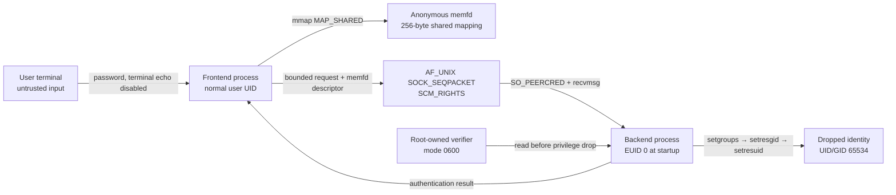

# Privilege-Separated Password Validation


A Linux authentication demonstration written in C. It applies process
isolation, UNIX-domain socket IPC, controlled shared memory, irreversible
privilege dropping and explicit sensitive-memory clearing.


## Architecture



The frontend and backend are independent executables with separate address
spaces. The frontend never receives permission to read the verifier file. The
backend accepts only one bounded validation request from an explicitly allowed
kernel UID.

## Security controls

| Objective | Implementation |
|---|---|
| Process isolation | Independently built `frontend` and `backend` processes |
| Local IPC | `AF_UNIX` and `SOCK_SEQPACKET` |
| Peer authentication | Kernel-supplied `SO_PEERCRED` |
| Controlled sharing | `memfd_create`, `mmap(MAP_SHARED)` and `SCM_RIGHTS` |
| Protocol validation | Magic, version, opcode, lengths, termination and descriptor checks |
| Protected verifier | Root ownership and unsafe-mode rejection |
| Memory protection | `mlock`, `MADV_DONTDUMP`, explicit volatile wipe and `munlock` |
| Permanent privilege loss | `setgroups`, `setresgid` and `setresuid` |
| Runtime verification | `getuid`/`geteuid` checks and rejected `setuid(0)` |
| Attack resistance | Wrong-peer and malformed-request rejection |

## Repository contents

```text
.
├── Frontend.c          # Unprivileged input-facing process
├── Backend.c           # Privileged validation and UID-drop process
├── Protocol.h          # Fixed request/response protocol
├── create_verifier.c   # Creates a demonstration crypt(3) verifier
├── Makefile            # Warning-clean build and disassembly targets
├── evidence-safe/      # Sanitized syscall and disassembly evidence
└── README.md
```

Compiled programs, raw traces, verifier databases and ZIP archives are excluded
through `.gitignore`.

## Requirements

- Linux with `memfd_create(2)` and UNIX-domain sockets
- C11 compiler and `make`
- libcrypt development headers
- `strace` and `objdump` for verification
- Root access for the backend privilege-drop demonstration

On Debian, Kali or Ubuntu:

```bash
sudo apt update
sudo apt install build-essential libcrypt-dev strace binutils
```

## Build

```bash
make clean
make
```

The Makefile enables:

```text
-std=c11 -O2 -Wall -Wextra -Wpedantic -Werror
```

Warnings are treated as errors. Generate disassembly with:

```bash
make disassembly
```

## Create a demonstration verifier

Use a temporary coursework-only password:

```bash
./create_verifier "$(whoami)" | sudo tee /etc/st5039-auth.db >/dev/null
sudo chown root:root /etc/st5039-auth.db
sudo chmod 600 /etc/st5039-auth.db
```

Never commit `/etc/st5039-auth.db`, its contents, or a reused password.

## Run

In terminal 1:

```bash
sudo ./backend \
  /run/st5039-auth.sock \
  /etc/st5039-auth.db \
  "$(id -u)" \
  "$(id -u nobody)" \
  "$(id -g nobody)" \
  "$(whoami)"
```

The backend initially reports `euid=0` and waits for one request.

In terminal 2:

```bash
./frontend /run/st5039-auth.sock "$(whoami)"
```

After validation, the backend replaces its real, effective and saved user/group
IDs. It then attempts `setuid(0)` and treats anything except `EPERM` as a fatal
security failure.

## Verification performed

The implementation was tested on Kali Linux using:

1. Warning-clean compilation of three C programs.
2. Correct-password acceptance.
3. Incorrect-password rejection.
4. Separate backend/frontend PIDs observed with `ps`.
5. `strace` confirmation of `memfd_create`, `SCM_RIGHTS`, `SO_PEERCRED`,
   `setresgid`, `setresuid` and failed `setuid(0)`.
6. Optimized disassembly confirming that the byte-wise clearing loop remained.
7. Rejection of an undersized, non-validation message.
8. Rejection of a client whose kernel UID did not match the allowed UID.

Only filtered evidence is suitable for publication. Unrestricted `strace` can
record terminal input or verifier fragments.

## Known limitations

- The backend handles one configured username and one request per execution.
- The demonstration verifier generator uses a fixed salt.
- The shared memfd remains writable, leaving a possible same-UID race.
- Root is retained during startup and validation; a pre-drop exploit is severe.
- Rate limiting, audit-log integrity, PAM integration, seccomp and SELinux
  confinement are outside this prototype.
- `mlock` and `MADV_DONTDUMP` reduce exposure but cannot prevent privileged
  live-memory inspection or erase copies made by libraries.

Possible extensions include random per-user salts, sealed memfds, private
backend copies, rate limiting, seccomp, service supervision and capability-based
startup.


